# Game Design Document (GDD)

## 1. Game Overview

* **Game Title**: Eternal Chronicles
* **One-line Pitch**: A pixel-art hub where you manage adventurers and more before sending them on missions
* **Genre**: simulation, adventure, management
* **Platform(s)**: PC
* **Target Audience**: strategy fans, cozy gamers, pixel-art lovers, Rimworld players & more.

---

## 2. Core Vision / Design Pillars

* **Curiosity & Discovery**
  The player should always feel a sense of anticipation: *“What happens next?”* — the next quest, the next clue, the next character to meet, or a hidden homage/inside reference waiting to be uncovered.

* **Guild & Tavern Management**
  At the core, the player manages their group of adventurers while keeping the tavern running. Balancing resources, relationships, and survival of the guild is key to success.

* **Dynamic Style & Replayability**
  The game uses a vibrant 2.5D pixel art style. Each playthrough offers branching stories and evolving tones — starting lighthearted, but gradually revealing darker layers based on the player’s choices. No two runs should feel exactly the same.

---

## 3. Gameplay

### Core Loop

1. **Recruit & Interact**
   Meet new adventurers, discover their quirks and backstories, and decide who to recruit into the guild.

2. **Prepare & Dispatch**
   Equip and assign adventurers to quests. Choices in team composition, supplies, and strategy influence outcomes.

3. **Quest Resolution (Away Phase)**
   Adventurers embark on missions off-screen. Outcomes are determined by their skills, traits, and the player’s prior decisions.

4. **Tavern Management (Home Phase)**
   While the adventurers are away, the player focuses on running the tavern — serving guests, upgrading facilities, handling events, and maintaining reputation.

5. **Return & Consequences**
   Adventurers return with loot, stories, injuries, or secrets. Their successes (or failures) ripple into the tavern’s economy and reputation, unlocking new opportunities and branching narratives.

6. **Progression**
   The cycle repeats, with the tavern and world gradually evolving. The deeper the player goes, the more complex the guild dynamics and the darker the underlying story becomes.

### Progression

1. **Narrative Progression (Story Arcs & Anticipation)**

   * Main storylines only unlock when the player achieves significant quest milestones (e.g. 80% success rate on critical missions).
   * Each arc escalates stakes: from tavern survival → political intrigue → uncovering darker secrets of the guild world.
   * Branching choices create *anticipation* (“What happens next?”) while ensuring replayability.

2. **Mechanics Progression (Guild & Tavern Systems)**

   * Core systems expand as the tavern survives longer:

     * Survive 1 year → Government introduces **taxation**.
     * Choose how to respond: pay, resist, manipulate.
   * Each choice unlocks new mechanics:

     * **Diplomacy (pay taxes)** → unlocks official trade permits & economic upgrades.
     * **Espionage (send rogue)** → introduces the **Assassins’ Guild**, with risks of betrayal & assassination events.
     * **Seduction (succubus route)** → unlocks **vice mechanics** (brothel, underground gambling) with higher risk/reward.

   #### Example Chain: First Month Taxes (Positive Unlocks)

   * **If Paid:**

     * Unlocks the **ability to purchase wine**.
     * Wine improves tavern reputation, attracting higher-tier clientele.
     * Enables recruitment chance for **wandering mages**.

   * **Ripple Effect:**

     * Unlocking new adventurer classes (like mages) opens unique quests and storylines.
     * Sets the stage for more branching progression chains.

3. **Exploration Progression (Tavern ↔ Town ↔ World)**

   * New areas of the town unlock based on narrative and mechanical choices:

     * Slums, black markets, underground catacombs, noble districts, rival guild halls.
   * Exploration is not free-roam, but **zone-based progression** (clickable hubs opening as the story unfolds).
   * Each unlocked area provides new adventurers, quests, or narrative twists.

### Failure Consequences

Failure is not a “game over,” but a branching path into darker or unexpected storylines.
Each failure has 3 parts: **Cause → Effect → Possible Return Arc**.

* **Debt & Slavery (Economy)**

  * *Cause:* Taxes or debts go unpaid.
  * *Effect:* Debt collectors seize one of the player’s adventurers, selling them into slavery.
  * *Possible Return Arc:* The adventurer may reappear scarred or changed — as a rival NPC, through a quest to free them, or randomly returning later with new traits.

* **Assassination Events (Espionage)**

  * *Cause:* Failed diplomacy or betrayal in dealings with the Assassins’ Guild.
  * *Effect:* Assassination attempts against adventurers or the player.
  * *Possible Return Arc:* Surviving assassinations could unlock new “vengeance” quests, or introduce new assassin NPCs tied to the guild.

* **Corruption Arcs (Vice/Temptation)**

  * *Cause:* Yielding to vice mechanics (succubus, brothel, gambling).
  * *Effect:* Certain adventurers become corrupted, gaining twisted traits or hidden loyalties.
  * *Possible Return Arc:* Corrupted characters may trigger unique questlines — betrayal, redemption, or even becoming lieutenants of Demon Lords.

### Player Objectives

* **Early Game Goals (Hidden Primary Objective)**

  * At first, the player’s focus is on **keeping the tavern afloat** and **building guild reputation** through quests and choices.
  * The true long-term purpose remains hidden, creating a natural sense of curiosity and progression.

* **Mid-Game Revelation (Formal Commission)**

  * Once the guild reaches significant reputation and stability, the local ruler takes notice.
  * The ruler formally commissions the guild to hunt down one of the Demon Lord’s generals — a new overarching objective that transforms the game’s stakes.

* **Late-Game Branching Paths**

  * After defeating a general, the guild may choose to:

    * **Speedrun Path** → Go straight for the Demon King with limited preparation (high risk, high reward).
    * **Epic Path** → Hunt down the remaining Demon Lord generals, gradually unlocking darker lore, new mechanics, and narrative twists before the final confrontation.

* **Hybrid Structure**

  * Failure is always possible: the tavern may collapse due to debt, betrayal, or dwindling adventurers.
  * Alternatively, the player can continue indefinitely, surviving and expanding while exploring side stories and replayable arcs.

---

## 4. Story & Setting

### **World / Theme**

A painterly 2.5D pixel-art fantasy world, blending cozy tavern life with darker undercurrents.
At the surface: bustling towns, laughter, and adventure.
Beneath it: corruption, secret guilds, and a looming demonic threat creeping into daily life.
The tavern serves as the beating heart of the story — a place of refuge, rumor, and crossroads between the mundane and the legendary.

### **Main Narrative Hook**

At first, the player’s goal is simply to **survive** as a tavern keeper and build a reputable guild.
Through whispers, quests, and hidden story arcs, the player gradually discovers that their guild’s rise is not accidental:

* Factions are watching.
* Nobles are plotting.
* Demonic forces are stirring.
  Eventually, the local ruler commissions the guild to fight back against the encroaching darkness — revealing the Demon Lords as the ultimate threat.

### Important Characters & Factions

* **The Player (Guildmaster/Tavern Keeper)**
  A newcomer, inheritor, or ambitious dreamer who runs the tavern and guild. Identity is flexible but central to all choices.

* **Recurring Homages & References**
  Throughout the game, players encounter characters, items, or events that nod to famous works of anime, manga, literature, and pop culture.
  These are never one-to-one copies, but playful reinterpretations that fit the game’s world.
  Examples:

  * A mysterious swordsman who resembles a certain wandering samurai (homage to *Rurouni Kenshin*).
  * A talking black cat who offers cryptic advice (homage to *Sailor Moon* / classic familiars).
  * A scholar obsessed with “the void” who quotes famous lines from Lovecraft.
  * Tavern guests retelling warped versions of iconic fantasy adventures (*Lord of the Rings*, *Record of Lodoss War*, *Berserk*, etc.).
    Purpose:

    * To spark *recognition and delight* (“Wait, I know this reference!”).
    * To encourage replayability (not all homages show up in every run).
    * To deepen the meta-narrative that the tavern is a crossroads of all stories, real and imagined.

* **Adventurers**
  A rotating cast of characters with unique traits, quirks, and (for some) personal storylines.

  * **Core Adventurers (with arcs):**
    A smaller curated set (e.g. 6–10 characters) have full **personal arcs** that unfold through quests, dialogue, and milestones.
    Their stories may interconnect, reveal hidden lore, or branch depending on player choices.

  * **Supporting Adventurers (without arcs):**
    The rest of the adventurers are lighter in scope.
    They provide mechanical variety (stats, traits, skills) and short flavor interactions, but no deep personal storyline.
    This keeps the world feeling large without overwhelming narrative scope.

  * **Replayability through Rotation:**
    Not every adventurer (or arc) appears in a single playthrough.
    This creates variety and replay value while keeping development focused.

* **The Local Ruler (Duke/Count/Baron)**
  Initially distant, later becomes pivotal. Their commission sets the stage for the Demon Lord conflict.

* **Hidden Factions**

  * **Assassins’ Guild** → unlocked by espionage/rogue choices.
  * **Succubus & Vices** → unlocked through corruption/temptation paths.
  * **Merchants & Nobles** → tied to taxation, trade, and diplomacy choices.

* **The Demon Lords**
  Shadowy figures whose presence is felt long before they appear. Each general represents a facet of corruption (War, Greed, Deceit, Desire, etc.), escalating the story’s tone from cozy to dire.

---

## 5. Art & Audio Direction

* **Visual Style**: 
  - 2.5D cinematic pixel art with painterly Ghibli-inspired atmosphere.  
  - Scenes are presented as **cross-sections of rural and urban areas**, like diorama cutaways.  
  - The starting hub includes the **tavern (core)**, a **marketplace**, and a **farm area**.  
  - Later progression can unlock additional town sections (slums, noble district, underground areas), expanding the cross-section view.  
  - Perspective: isometric / angled view, similar to *The Last Night* or the references in the 3D pixel art showcase videos.  
  https://www.youtube.com/watch?v=NNr7_fcJqWQ  https://www.youtube.com/watch?v=sQf1z8dFcao and https://www.youtube.com/watch?v=AdrSpqmmyfk

* **Key Inspirations**: 
  - *The Last Night* (for cinematic pixel depth).  
  - Studio Ghibli (for warmth, nature detail, painterly mood).  
  - *Octopath Traveler* (for layered depth and lighting in pixel scenes).  
  - Player’s own diorama sketches (cross-section with tavern, market, fields).  

* **Music & Sound**: 
  - **Tavern:** cozy lute/folk music, warm ambience (chatter, mugs clinking, fireplace, bard corner).  
  - **Open Market/Farm:** light, playful day themes with natural sounds (wind, livestock, vendors calling, people walking in and out).  
  - **Slums/Underground:** low, moody tones with distant echoes, dripping water, muffled crowds, running steps.   
  - **Demon Lords / Late Game:** dark orchestral layers blended with unsettling ambient effects to heighten tension.   https://www.youtube.com/watch?v=dzCuwjHFd7M
  - Dynamic soundtrack system that shifts tone as the story darkens, while keeping the cozy core intact.   

---

## 6. Systems
### Core Interaction
- The player controls an avatar that **walks around the living diorama**.  
- When entering a building, the exterior walls are removed to reveal a **cross-section interior**.  
- Interiors are functional spaces:  
  - **Tavern**: the centerpiece, with distinct interactable zones.  
  - **Market**: hub for trading, random encounters, and progression events.  
  - **Farm & other zones**: support future encounters, resource flow, and story events.  

### Tavern Layout & Functions
- **Bar Counter**:  
  - Buy stock (food, drink, wine).  
  - Manage tavern supplies and reputation.  

- **Guild Desk**:  
  - Handle **Recruitment**.  
  - Assign newly arrived adventurers or review roster.  

- **Mission Board (on the wall)**:  
  - Access and accept **quests/missions**.  
  - Missions scale in difficulty, availability tied to tavern reputation and story progression.  

- **Stairs / Rooms**:  
  - Adventurers (or NPCs) may stay overnight.  
  - Opens possibilities for intel gathering, robberies, secret events, or narrative encounters.  

### Market & Encounters
- Walking to the **market zone** triggers economic systems and possible random encounters.  
- The market is also a gateway to **progression mechanics** (new items, rare characters, rumors).  

### Economy & Resources
- Always visible in a small **UI overlay** (gold, food, drink, materials, reputation).  
- Updated in real-time as the player interacts with tavern/market/farm systems.  

### UI & Menus
- UI elements only appear **after interacting** with a physical object/zone in the diorama.  
  - Example:  
    - Interact with **bar** → Inventory & stock menu opens.  
    - Interact with **mission board** → Quest list menu opens.  
    - Interact with **guild desk** → Recruitment/roster menu opens.  
- This keeps immersion intact: the diorama is the **primary interface**, menus are contextual. 

```mermaid
flowchart TD
    A[Player in Tavern Main View] --> B{Interactive Zone Detection}
    
    B -->|Hover Desk| C[Show Desk Highlight]
    B -->|Hover Mission Board| D[Show Mission Highlight] 
    B -->|Hover Bar| E[Show Bar Highlight]
    B -->|Hover Stairs| F[Show Stairs Highlight - Coming Soon]
    
    C -->|Click| G[📋 Recruitment Menu - Alpha]
    D -->|Click| H[⚔️ Mission Menu - Alpha]
    E -->|Click| I[🍺 Stock Menu - Alpha]
    F -->|Click| J[🛏️ Room Events - Beta Feature]
    
    G --> K[Overlay: Recruitment Interface]
    H --> L[Overlay: Mission Selection Interface]
    I --> M[Overlay: Beer Management Interface]
    J --> N[Overlay: Adventurer Quarters - Not Yet Implemented]
    
    K -->|Close/Complete| A
    L -->|Close/Complete| A
    M -->|Close/Complete| A
    N -->|Close/Complete| A
    
    A --> O[⏰ Next Day Button]
    O --> P[Day Progression System]
    
    P --> Q[📊 Calculate Mission Results]
    Q --> R[💰 Update Gold/Beer/Wages]
    R --> S[📜 Generate Event Messages]
    S --> T[🔄 Update All UI Overlays]
    T --> A
    
    %% Future expansion paths
    A -.->|Future: Travel| U[🗺️ Market/World Map - Future]
    U -.-> V[🏪 Market Events - Future]
    V -.-> A

    %% Farm Management System - Future
    A -.->|Future: Manage Farm| W[🚜 Farm Management - Future]
    W -.-> X[🌾 Crop Planning & Planting, seasons?]
    W -.-> Y[🐄 Livestock Management]
    W -.-> Z[📦 Harvest & Processing]
    
    X -.-> AA[⏰ Wait for Growth Time]
    Y -.-> BB[🥛 Daily Resource Collection]
    Z -.-> CC[🍞 Food Production]
    
    AA -.-> Z
    BB -.-> CC
    CC -.-> DD[🍽️ Feed Tavern Customers]
    DD -.-> EE[💰 Increased Tavern Income]
    EE -.-> A

    %% Farm-Tavern Integration
    CC -.->|Alternative| FF[🏪 Sell at Market]
    FF -.-> EE
    
    %% Styling
    style A fill:#e8f5e8,stroke:#4caf50,stroke-width:3px
    style G fill:#fff3e0,stroke:#ff9800,stroke-width:2px
    style H fill:#ffebee,stroke:#f44336,stroke-width:2px
    style I fill:#e3f2fd,stroke:#2196f3,stroke-width:2px
    style J fill:#f3e5f5,stroke:#9c27b0,stroke-width:2px,stroke-dasharray: 5 5
    style O fill:#fff8e1,stroke:#ffc107,stroke-width:3px
    style U fill:#f3e5f5,stroke:#9c27b0,stroke-dasharray: 5 5
    style V fill:#f3e5f5,stroke:#9c27b0,stroke-dasharray: 5 5
```

## 7. Scope & Roadmap

* **MVP (Minimal Viable Product)**:
  - Core **diorama hub** (tavern + basic market + farm view).  
  - Player avatar can **walk** inside the diorama and interact with key zones:  
    - **Desk** → Recruitment Menu (basic roster system).  
    - **Mission Board** → Mission Menu (accept simple quests).  
    - **Bar** → Stock Menu (basic economy: buy/sell beer/food).  
  - Basic **Next Day cycle** with mission resolution and resource update.  
  - **Overlay UI** for gold, stock, and reputation tracking.  
  - 2–3 adventurers (mixed between core and supporting), with placeholder arcs or traits.  

* **Stretch Features**:
  - **Expanded Town**: unlockable slums, noble quarter, underground areas.  
  - **Failure Consequences** (slavery, assassinations, corruption arcs).  
  - **Core Adventurer Arcs**: interlinked stories inspired by *Dungeon of the Endless*.  
  - **Dynamic soundtrack system** (shifting from cozy → darker tones).  
  - **Market Encounters**: traveling merchants, rival guild NPCs, special recruitment.  
  - **Vice Systems**: gambling, brothel, corruption paths.  
  - **Multiple Demon Lord generals** and branching late-game paths.  

* **Tools/Engine**:
  - **Engine:** Godot 4 (2.5D diorama presentation).  
  - **Art:** Aseprite / Pixel FX Designer (for sprites, animations), Blender (if hybrid 3D elements).  
  - **Audio:** FMOD or Godot’s built-in audio, royalty-free packs + custom compositions later.  
  - **Version Control:** GitHub for source, project docs in Markdown.  
  - **Task/Design Management:** Notion or Obsidian for feature tracking and lore expansion.
